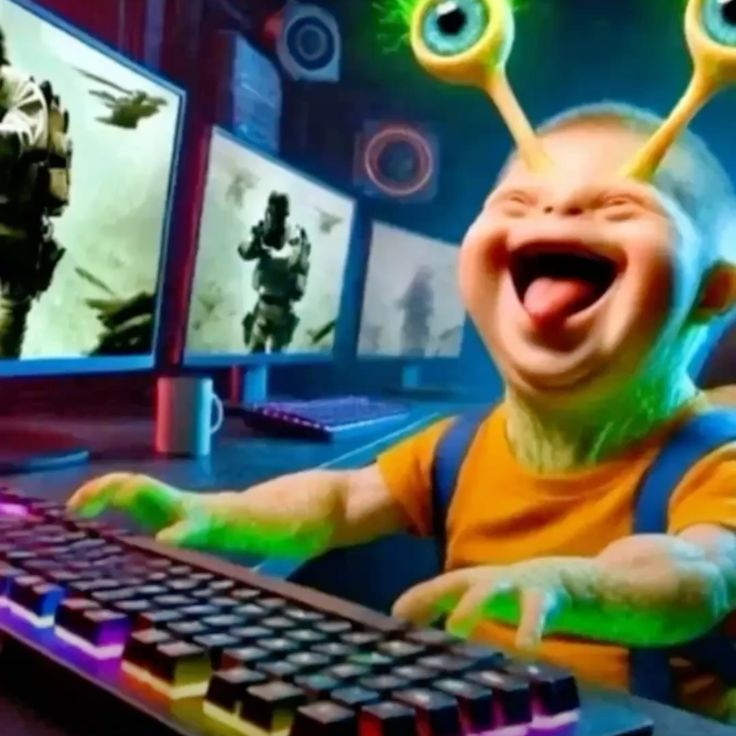

# 📺 Fall Guys: As Olimpíadas do Faustão Digitais

Este repositório prova que Fall Guys é a versão moderna e virtual do maior patrimônio da TV brasileira.

---

### 🪵 Semelhanças Cientificamente Comprovadas

* **Pontes do Rio Que Cai:** Percursos escorregadios e plataformas que despencam sem aviso.
* **Martelos Giratórios:** Obstáculos gigantescos projetados puramente para arremessar você longe.
* **Física da Humilhação:** Jujubas tropeçando e caindo de cara na lama igualzinho aos competidores de domingo.
* **Fantasias Ridículas:** Roupas infláveis e desajeitadas que desafiam a gravidade e o bom gosto.
* **Caos Coletivo:** Sessenta pessoas correndo desesperadas por um espaço que claramente não cabe todo mundo.
* **Trilha Sonora Tensa:** Ritmo acelerado que evoca o puro sentimento de "quem sabe faz ao vivo".

---

### 🏆 Modos de Jogo vs Clássicos do Domingão

1. **Portas Malucas:** A versão definitiva do "Errou!".
2. **Passarela de Gelo:** O verdadeiro teste de equilíbrio e frustração.
3. **Escalada do Sucesso:** A subida final valendo o topo do pódio (e a Coroa).

# 📺 Fall Guys:

Este repositório prova que Fall Guys é a versão moderna e virtual do maior patrimônio da TV brasileira.🪵 
Semelhanças Cientificamente Comprovadas em fallguys leanguage

## 📋 Sumário
- [Descrição](Muito dificil)
- [Pré-requisitos](Pc gamer ryzen 9 + rtx 5090)
- [Instalação](#emulador de play store)
- [Uso](abrir e usar idiota)
- [Funcionalidades](E jogo para se irritar no fim de semana)
- [Contribuição](lucas goat, yago adm)
- [Licença](mit license)

## 📝 Descrição
Este repositório prova que Fall Guys é a versão moderna e virtual do maior patrimônio da TV brasileira.🪵 
Semelhanças Cientificamente Comprovadas 
Pontes do Rio Que Cai: Percursos escorregadios e plataformas que despencam sem aviso.
Martelos Giratórios: Obstáculos gigantescos projetados puramente para arremessar você longe.
Física da Humilhação: Jujubas tropeçando e caindo de cara na lama igualzinho aos competidores de domingo.
Fantasias Ridículas: Roupas infláveis e desajeitadas que desafiam a gravidade e o bom gosto.
Caos Coletivo: Sessenta pessoas correndo desesperadas por um espaço que claramente não cabe todo mundo.
Trilha Sonora Tensa: Ritmo acelerado que evoca o puro sentimento de "quem sabe faz ao vivo".🏆 
Modos de Jogo vs Clássicos do DomingãoPortas Malucas:
 A versão definitiva do "Errou!".
 Passarela de Gelo: O verdadeiro teste de equilíbrio e frustração.
 Escalada do Sucesso: A subida final valendo o topo do pódio (e a Coroa).💻
 Como Jogar com o Espírito do Faustão bash 
 git clone github.com
cd olimpiadas-do-faustao
npm run testar-equilibrio -- --locutor="oloko-bicho"

## ⚙️ Pré-requisitos
- Node.js v999+
- npm v999+
- Docker (Obrigatorio)

- 

 
